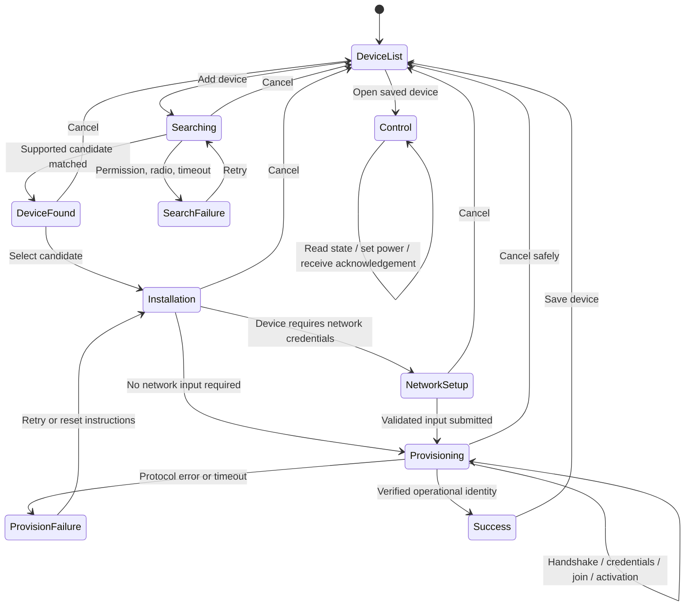

# Device onboarding workflow contract

Last reviewed: 2026-08-05

Status: the Tuya Smart Life SDK adapter is implemented for account/Home,
BLE discovery, combo activation, persistence, DP on/off control, and confirmed
cloud unbinding before local deletion, but it is now an optional cloud-backed
profile. The selected primary requirement is fresh provisioning and control
without WAN or mobile data. A direct Shelly Gen2+/Gen3 JSON-RPC profile is the
recommended first offline implementation; exact device procurement and physical
verification are pending.
No simulated candidate is injected into runtime discovery.

Human-facing protocol research and official source links:
[`docs/device-onboarding-protocols.md`](../../../docs/device-onboarding-protocols.md).
The offline-LAN decision and detailed acceptance conditions are canonical in
[`offline-lan-architecture.md`](offline-lan-architecture.md).
The multi-ecosystem goal, connectivity classes, and outage behavior are
canonical in [`universal-device-platform.md`](universal-device-platform.md).

## Product intent

The Android application must lead a user through one complete smart-device
workflow:

1. view already added devices;
2. search for devices that are ready for pairing;
3. identify a discovered device by a user-readable name and profile;
4. prepare or authorize installation;
5. configure the device for the target network when required;
6. observe real provisioning and activation progress;
7. verify and persist the successfully added device;
8. open a control surface and confirm an on/off action.

The workflow succeeds only when the application receives protocol-level
evidence that the device was added and the resulting control action is
acknowledged by the device or its authoritative integration.

## Scope rules

- A radio advertisement is a discovery candidate, not proof that the device is
  supported.
- A device is supported only when a `DeviceProfile` selects an implemented
  discovery matcher, provisioner, controller, capability schema, and
  verification strategy.
- Generic Bluetooth, HTTP, mDNS, SSDP, or Wi-Fi presence must not be presented
  as universal compatibility.
- Device-specific transports and cloud SDKs stay behind adapters.
- The first release may support one ecosystem and one physical device.
  Additional ecosystems extend the profile registry without changing
  the user-visible workflow contract.
- Wi-Fi credentials are transient provisioning input and must not be retained
  after the provisioning session ends.

## Actors and systems

- User: selects a device, authorizes permissions, supplies network credentials,
  names the device, selects a room, and sends control commands.
- Android app: coordinates discovery, provisioning, persistence, and control.
- Device: advertises pairing readiness, accepts onboarding data, joins its
  operational transport, and reports state.
- Optional vendor cloud: issues activation tokens, binds accounts/homes, stores
  capability schemas, and routes commands.
- Optional gateway: provisions and controls Zigbee, Bluetooth mesh, Thread, or
  other sub-devices.
- Local network: carries provisioning or operational traffic where supported.

## Core domain contracts

```text
DeviceProfile
├── profileId
├── matchers
├── provisioningMode
├── controllerKind
├── capabilitySchema
└── verificationPolicy

DiscoveredCandidate
├── stableCandidateId
├── advertisedName
├── transport
├── profileMatch
├── signalOrEndpoint
└── pairingReadiness

ProvisioningSession
├── sessionId
├── candidate
├── state
├── progressEvidence
├── retryCount
└── terminalResult

SavedDevice
├── deviceId
├── profileId
├── displayName
├── roomId
├── operationalEndpointOrBinding
├── connectionState
└── capabilities
```

## State machine



## Workflow stages

### 1. Device list

- Show only saved devices, not transient scan results.
- Show display name, room, online/offline/unknown state, and last known primary
  capability state.
- Preserve device identity across endpoint or IP-address changes.
- Opening an unavailable device shows a recoverable error instead of silently
  toggling cached state.

### 2. Search

- Request only permissions needed by enabled discovery adapters.
- Clear previous candidates before every scan so the visible count starts at
  zero; publish only real platform scan callbacks as they arrive.
- Do not inject demo, mock, emulator, fixture, or other synthetic candidates
  into runtime discovery or saved-device lists.
- Run enabled scans concurrently within bounded timeouts.
- Deduplicate candidates by a profile-defined stable identity.
- Distinguish unsupported radio observations from supported candidates.
- Stop discovery on explicit cancellation and when the owning lifecycle ends.

### 3. Device found

- Resolve a user-readable name, product/profile, transport, and signal or
  endpoint.
- Do not infer support from an advertised name alone.
- If multiple profiles match, require deterministic priority or explicit user
  selection.
- Selecting a candidate freezes the required identity fields for the current
  provisioning session.

### 4. Installation preparation

- Show profile-specific reset, button, indicator, QR, gateway, or authorization
  instructions.
- Verify pairing readiness when the protocol exposes it.
- Detect already-bound or app-restricted devices and explain the required
  recovery action.

### 5. Network setup

- Ask for network data only when the selected provisioner requires it.
- On entry, request the foreground Wi-Fi scan permissions and refresh the
  Android access-point scan. Present visible 2.4 GHz SSIDs as a dropdown,
  deduplicated by SSID and ordered by strongest signal; do not accept an
  arbitrary typed SSID in this prototype flow.
- Keep the last successful list visible during a manual refresh, and surface
  permission denial, disabled Wi-Fi or location services, scan throttling,
  timeout, and an empty compatible result as recoverable states.
- Validate non-empty SSID, credential shape, and profile frequency constraints.
- Prefer a device-reported list of compatible access points when supported.
- Keep the password in session memory only; clear it on success, failure,
  cancellation, process recreation, or timeout.

### 6. Provisioning

Progress must reflect real protocol evidence rather than a timer animation.
Possible evidence stages are:

1. provisioning transport connected;
2. device identity or authorization verified;
3. credentials accepted;
4. device joined the router or gateway;
5. cloud or fabric activation completed when applicable;
6. operational endpoint discovered;
7. authoritative state read succeeded.

Every adapter maps its native callbacks to these normalized stages. Unsupported
stages are omitted, not simulated.

### 7. Success

- Success requires a stable operational device identity.
- Persist the profile, operational binding, capabilities, name, and room.
- Never persist the Wi-Fi password.
- A user may rename the device, select a room, and decide whether it appears on
  the main screen.
- If persistence fails after activation, preserve enough non-secret recovery
  context to reconcile the device without activating it again blindly.

### 8. Control

- Read the authoritative initial power state before enabling the primary
  toggle, unless the integration explicitly provides a trusted state snapshot.
- Treat command acceptance and physical state acknowledgement as separate
  events.
- Disable or mark the control pending while a non-idempotent command is in
  flight.
- On failure, restore the last confirmed state and show an actionable error.
- Device-specific capabilities such as timers, locks, metering, and relay modes
  are derived from the capability schema rather than hard-coded globally.

## Integration boundaries

```kotlin
interface DeviceDiscoveryAdapter {
    val candidates: Flow<List<DiscoveredCandidate>>
    suspend fun start(): Result<Unit>
    suspend fun stop()
}

interface DeviceProvisioner {
    val progress: Flow<ProvisioningProgress>
    suspend fun provision(request: ProvisioningRequest): Result<ProvisionedDevice>
    suspend fun cancel()
}

interface DeviceController {
    suspend fun readCapabilities(device: SavedDevice): Result<DeviceSnapshot>
    suspend fun execute(device: SavedDevice, command: DeviceCommand): Result<CommandReceipt>
}
```

Concrete implementations can include Tuya, Matter, ESPHome Improv, Shelly,
vendor BLE GATT, local HTTP/RPC, and gateway-backed adapters.

## Failure and recovery contract

The UI must distinguish at least:

- permission denied;
- required radio disabled or unsupported;
- no supported candidate found;
- device left pairing mode;
- authorization or attestation failed;
- already bound or restricted to another app;
- wrong Wi-Fi password;
- unsupported Wi-Fi band or security mode;
- BLE or AP transport disconnected;
- router/gateway join timeout;
- cloud/fabric activation failure;
- device activated but operational discovery failed;
- command rejected, timed out, or not acknowledged;
- persistence failure after activation.

Each failure defines whether retry can resume the current session, requires the
device to re-enter pairing mode, or requires rollback/unbinding.

## Security and privacy invariants

- Do not write Wi-Fi passwords, AppSecret values, activation tokens, device
  secrets, or account sessions to logs, analytics, project memory, or Git.
- Store durable device/account tokens only through the platform-approved secure
  storage boundary.
- Use short-lived activation tokens where the ecosystem supports them.
- Bind callbacks and discovered identities to the active provisioning session
  so stale events cannot complete another device's flow.
- Validate vendor, product, discriminator, UUID, or attestation data before
  persisting a device.
- Cancel scans, sockets, GATT connections, callbacks, and polling when a session
  terminates.

## Verification contract

The first supported profile is accepted only when a fresh installation can:

1. request required permissions;
2. discover exactly one supported physical test device;
3. identify it by a stable profile and readable name;
4. complete the documented preparation step;
5. provide network data when required;
6. expose real progress and at least one forced failure path;
7. persist and reopen the added device;
8. read its power state;
9. toggle power and observe authoritative acknowledgement;
10. surface connection and command failures without losing the saved device.

Unit tests cover state transitions, deduplication, mapping, cancellation,
timeouts, credential clearing, and command acknowledgement. Integration tests
exercise the selected SDK against a physical reference device. Physical-device
evidence remains required before claiming support for a physical product.

## Current implementation map

- Tuya BLE discovery, activation, control and Home unbinding: `app/src/main/java/com/dimosfil/smarthome/tuya/TuyaIntegration.kt`
- generic BLE discovery retained for future vendor adapters: `app/src/main/java/com/dimosfil/smarthome/discovery/BluetoothDeviceDiscovery.kt`
- mDNS discovery: `app/src/main/java/com/dimosfil/smarthome/discovery/NsdDeviceDiscovery.kt`
- merged discovery list: `app/src/main/java/com/dimosfil/smarthome/discovery/DeviceRepository.kt`
- profile and adapter registries: `app/src/main/java/com/dimosfil/smarthome/onboarding/`
- controller boundary and prototype HTTP adapter: `app/src/main/java/com/dimosfil/smarthome/control/`
- persistent non-secret device metadata: `app/src/main/java/com/dimosfil/smarthome/persistence/DeviceStore.kt`
- workflow coordinator: `app/src/main/java/com/dimosfil/smarthome/ui/OnboardingViewModel.kt`
- eight Compose surfaces: `app/src/main/java/com/dimosfil/smarthome/ui/SmartHomeApp.kt`

The default search starts with zero candidates and publishes only Tuya SDK or
DNS-SD observations. The prototype automatically creates a Tuya technical
account through UID login; its random UID and password stay in private Android
preferences and the SDK owns session storage. Wi-Fi credentials are held only
for the active operation and cleared afterward. Remaining completion evidence
is a successful pairing plus physical relay toggle on the selected product.

## Selected integration direction

The platform retains Tuya Smart Life and adds direct Shelly Gen2+/Gen3 local
JSON-RPC with AP provisioning and mDNS rediscovery. Tuya must not gate discovery
or use of local adapters; adapter failures remain isolated.
ESPHome Improv, Home Assistant, Matter, and documented vendor adapters remain
extension points behind the same registries. Only strict offline evidence from
a selected physical device can complete the product workflow.
